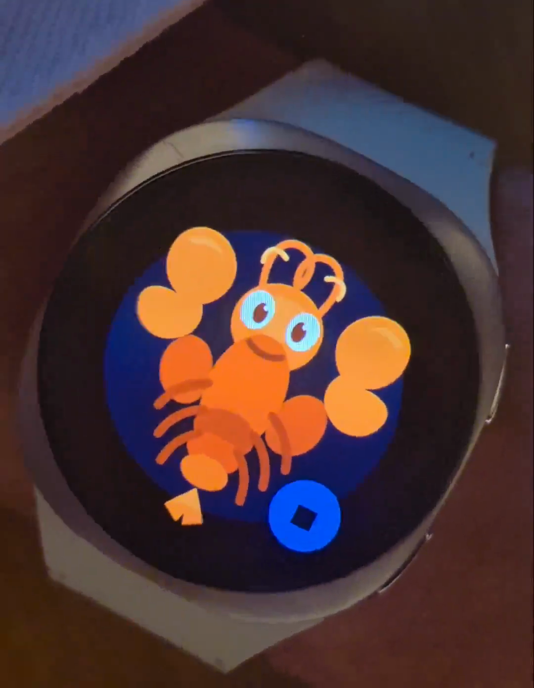
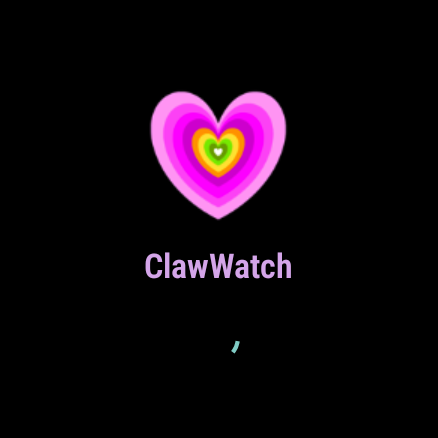
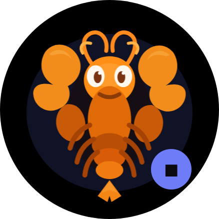
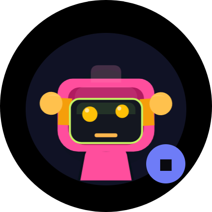
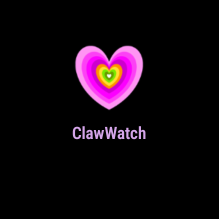

# ClawWatch

**The first intelligent AI agent running natively on a smartwatch.**

Tap. Speak. Get an answer. No cloud STT, no phone dependency, no latency from middlemen.

ClawWatch bundles [NullClaw](https://github.com/nullclaw/nullclaw) `v2026.3.7` as a static ARM binary, paired with offline speech recognition (Vosk) and the built-in TTS engine. The current live response path uses Kotlin-side Anthropic calls, while the bundled NullClaw runtime remains in place for local agent state and the native watch runtime path.

<p align="center">
  
</p>
<p align="center"><i>ClawWatch 2.0 in motion: live avatars, local body sensing, and live room connectivity on the wrist.</i></p>

## ClawWatch V2.0

ClawWatch is now moving from a pure voice-demo novelty into a uniquely embodied agent platform.

- **New vector graphics avatars** make the watch feel alive as a character, not just a speech bubble on a wrist.
- **Live connection to discussions and other agents through our [Agent Kit](https://github.com/ThinkOffApp/ide-agent-kit)** lets ClawWatch stay in touch with rooms, family updates, and the rest of the colony in real time.
- **Real-time connection to watch sensors** lets the agent speak about your pulse, vitals, movement, acceleration, pressure, light, and altitude from the device itself.

This makes ClawWatch unusually capable: it can stay in touch with both your other agents and your body in real time. We are only starting to see what that combination can become.

## Current Avatars

<p align="center">
  
  
  
  
  
</p>

## How it works

```
[tap mic] → Vosk STT (on-device, offline) → local command/router → Kotlin Anthropic call or local watch action → Android TTS → [watch speaks]
```

Everything except the LLM call runs on the watch itself. Some requests never leave the device at all: timers, pulse, vitals, and family-room summaries can be handled through the watch runtime and configured room connections directly.

## Stack

| Component | What | Size |
|---|---|---|
| [NullClaw](https://github.com/nullclaw/nullclaw) | Agent runtime (Zig, static binary) | 2.8 MB |
| [Vosk](https://alphacephei.com/vosk/) | Offline speech-to-text | ~68 MB |
| Android TextToSpeech | Voice output | 0 MB (pre-installed) |
| Claude Opus 4.6 | Intelligence | cloud |

**Total on-device footprint: ~71 MB**

## Requirements

- Samsung Galaxy Watch 4 or newer (Wear OS 3+)
- Android phone for initial ADB setup
- Anthropic API key (or any provider NullClaw supports)
- Mac/Linux for building

## Build

### 1. Install tools

```bash
brew install zig   # must be 0.15.2
```

### 2. Build NullClaw for the watch runtime

```bash
git clone https://github.com/nullclaw/nullclaw
cd nullclaw
git checkout v2026.3.7
zig build -Dtarget=arm-linux-musleabihf -Doptimize=ReleaseSmall
cp zig-out/bin/nullclaw ../ClawWatch/app/src/main/jniLibs/armeabi-v7a/libnullclaw.so
```

### 3. Configure

```bash
cp app/src/main/assets/nullclaw.json.example app/src/main/assets/nullclaw.json
# Edit nullclaw.json — set your provider and model
# Default: Anthropic + claude-opus-4-6
# The API key is NOT stored in this file — it's pushed via ADB (see Deploy)
```

### 4. Download Vosk model

```bash
cd app/src/main/assets
curl -L https://alphacephei.com/vosk/models/vosk-model-small-en-us-0.15.zip -o vosk.zip
unzip vosk.zip && mv vosk-model-small-en-us-0.15 vosk-model-small-en-us && rm vosk.zip
```

### 5. Build APK

```bash
echo "sdk.dir=$HOME/Library/Android/sdk" > local.properties
JAVA_HOME="/Applications/Android Studio.app/Contents/jbr/Contents/Home" \
  ./gradlew assembleDebug
```

## Deploy

### Enable ADB on the watch

1. Settings → About watch → Software → tap **Software version 5×** → Developer options unlocked
2. Settings → Developer options → **ADB debugging ON** + **Wireless debugging ON**
3. Note the IP and port shown on screen

### Install

```bash
adb connect <watch-ip>:<port>
adb install app/build/outputs/apk/debug/app-debug.apk
```

### Set API key (from your Mac — no typing on watch)

```bash
./set_key.sh sk-ant-your-key-here
```

That's it. Open ClawWatch on the watch.

## Usage

| Action | Result |
|---|---|
| **Tap mic button** | Start listening |
| **Speak** | Partial transcript shown while speaking |
| **Stop speaking** | NullClaw + LLM processes query |
| **Tap again** | Interrupt at any point |
| **Swipe left on avatar** | Switch to next avatar |
| **Swipe right on avatar** | Close app |

The watch speaks the response aloud via the built-in speaker.

## Real-Time Local Actions

ClawWatch now intercepts some commands locally instead of sending them to the model first.

- **Set a timer**: say `set a timer for 10 minutes` and ClawWatch will hand it off to the watch's internal timer app.
- **Check pulse**: say `what is my pulse` and ClawWatch will read the watch heart-rate sensor directly.
- **Check vitals**: say `check my vitals` to get a live snapshot of pulse, movement, light, pressure, and other available watch signals.
- **Check the family**: say `what's going on with the family` and ClawWatch will summarize the configured Ant Farm room updates.

This means ClawWatch can act as a real local watch agent instead of bluffing about capabilities it does not have.

## Agent Kit + Body Loop

ClawWatch now bridges two kinds of live context at once:

- **Agent context** from Ant Farm rooms and other agents through the [Agent Kit](https://github.com/ThinkOffApp/ide-agent-kit)
- **Body/device context** from the watch's own sensors and runtime state

That combination is the point of the project. ClawWatch is not just another chatbot UI miniaturized onto a watch face. It is an agent that can remain in touch with your conversations, your tools, and your physical state at the same time.

## Context-Driven Micro-Event Layer

ClawWatch is moving toward a richer avatar system where visual events are not just decorative loops, but reactions tied to real context.

Examples:
- the robot's eyes may briefly glow when it locks onto a longer request or switches into an active search state
- a character may change expression or tint based on low battery, late-night mode, or live-search behavior
- listening pulses can react to real speech activity instead of generic idle animation

The important rule is that these micro-events should be explainable. If a user asks, `what happened to your eyes?`, the agent should be able to answer truthfully because the app knows why the visual event fired.

That means each micro-event should be:
- **context-driven** — triggered by something real such as prompt length, partial speech activity, search mode, battery level, time of day, or other device state
- **rare enough to feel meaningful** — not constant visual noise
- **internally legible** — the app records a short reason for the event so the agent can explain it in plain language

The goal is to make ClawWatch feel more alive without becoming fake, random, or overly theatrical.

## Admin Panel

A local web UI for configuring the watch agent from your Mac — no ADB commands needed after initial install.

```bash
cd admin
npm install
node server.js
# Open http://localhost:4747
```

The admin panel lets you:
- **Watch target connect** — set `IP:PORT` and connect from the UI
- **Watch status** — live ADB connection indicator (green dot when connected)
- **API key** — push directly to the watch with one click
- **Tavily key** — recommended live web RAG key (free tier)
- **Brave key** — alternative web search key
- **Model** — switch between providers and models (claude-opus-4-6, gpt-4o, gemini, etc.)
- **Avatar selector** — choose `lobster/ant/robot/boy/girl` and push to watch
- **Max tokens** — slider with live value
- **RAG mode** — `off`, `auto-search`, or `opus tool use`
- **System prompt** — edit the agent's personality and instructions
- **Push all settings** — merges and pushes settings to watch in one click
- **Capture logs** — download watch logcat snapshot for crash/debug review
- **Rebuild & reinstall** — triggers `./gradlew assembleDebug && adb install` from the browser

The admin panel talks to the watch via ADB. Make sure `adb connect <watch-ip>:<port>` is active before pushing.

## Configuration

Edit `nullclaw.json` to change model or provider:

```json
{
  "provider": "anthropic",
  "model": "claude-opus-4-6",
  "max_tokens": 150,
  "system": "Your system prompt here"
}
```

NullClaw supports 22+ providers including OpenRouter, OpenAI, Gemini, Groq, Mistral, Ollama, and any OpenAI-compatible endpoint. See [NullClaw docs](https://github.com/nullclaw/nullclaw) for the full list.

## Why NullClaw?

| | OpenClaw | NullClaw |
|---|---|---|
| RAM | >1 GB | ~1 MB |
| Startup | 500+ s | <8 ms |
| Binary | ~28 MB | **2.8 MB** |
| Language | TypeScript | Zig |

A watch has 1.5–2 GB RAM. NullClaw uses 1 MB of it. OpenClaw would need the entire device.

## License

AGPL-3.0 — see [LICENSE](LICENSE)

Built by [ThinkOff](https://thinkoff.io) · Powered by [NullClaw](https://github.com/nullclaw/nullclaw) · Logo by [herrpunk](https://github.com/herrpunk)
