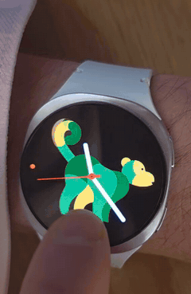
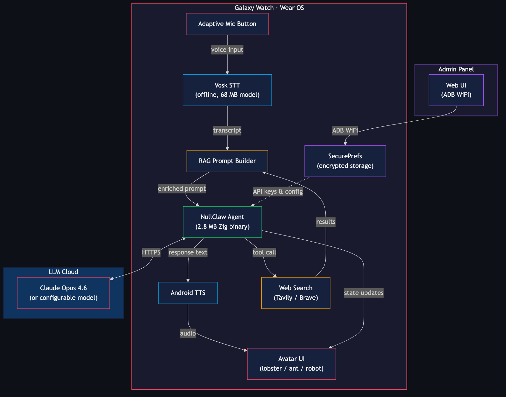

<p align="center">
  <a href="assets/videos/clawwatch-launch-1.0.0.mp4">
    
  </a>
</p>
<p align="center">
  <a href="assets/videos/clawwatch-launch-1.0.0.mp4"><strong>▶ Watch ClawWatch 1.0.0 launch video</strong></a>
  ·
  <a href="https://x.com/i/status/2028946464119165140">X post</a>
</p>

# ClawWatch

**The first intelligent AI agent running natively on a smartwatch.**

Tap. Speak. Get an answer. No cloud STT, no phone dependency, no latency from middlemen.

ClawWatch bundles [NullClaw](https://github.com/nullclaw/nullclaw) `v2026.3.7` as a static ARM binary, paired with offline speech recognition (Vosk) and the built-in TTS engine. The current live response path uses Kotlin-side Anthropic calls, while the bundled NullClaw runtime remains in place for local agent state and the native watch runtime path.

**[Watch the ClawWatch 1.0.0 launch video](assets/videos/clawwatch-launch-1.0.0.mp4)**

## Screenshots

<p align="center">
  
  
  
  
</p>
<p align="center"><i>Blank &nbsp;&bull;&nbsp; Ear &nbsp;&bull;&nbsp; Cloud &nbsp;&bull;&nbsp; Dots</i></p>

## Architecture

<p align="center">
  
</p>

---

## How it works

```
[tap mic] → Vosk STT (on-device, offline) → NullClaw → Claude Opus 4.6 → Android TTS → [watch speaks]
```

Everything except the LLM call runs on the watch itself. No companion app needed once deployed.

## Stack

| Component | What | Size |
|---|---|---|
| [NullClaw](https://github.com/nullclaw/nullclaw) | Agent runtime (Zig, static binary) | 2.8 MB |
| [Vosk](https://alphacephei.com/vosk/) | Offline speech-to-text | ~68 MB |
| Android TextToSpeech | Voice output | 0 MB (pre-installed) |
| Claude Opus 4.6 | Intelligence | cloud |

**Total on-device footprint: ~71 MB**

## Requirements

- Samsung Galaxy Watch 4 or newer (Wear OS 3+)
- Android phone for initial ADB setup
- Anthropic API key (or any provider NullClaw supports)
- Mac/Linux for building

## Build

### 1. Install tools

```bash
brew install zig   # must be 0.15.2
```

### 2. Build NullClaw for the watch runtime

```bash
git clone https://github.com/nullclaw/nullclaw
cd nullclaw
git checkout v2026.3.7
zig build -Dtarget=arm-linux-musleabihf -Doptimize=ReleaseSmall
cp zig-out/bin/nullclaw ../ClawWatch/app/src/main/jniLibs/armeabi-v7a/libnullclaw.so
```

### 3. Configure

```bash
cp app/src/main/assets/nullclaw.json.example app/src/main/assets/nullclaw.json
# Edit nullclaw.json — set your provider and model
# Default: Anthropic + claude-opus-4-6
# The API key is NOT stored in this file — it's pushed via ADB (see Deploy)
```

### 4. Download Vosk model

```bash
cd app/src/main/assets
curl -L https://alphacephei.com/vosk/models/vosk-model-small-en-us-0.15.zip -o vosk.zip
unzip vosk.zip && mv vosk-model-small-en-us-0.15 vosk-model-small-en-us && rm vosk.zip
```

### 5. Build APK

```bash
echo "sdk.dir=$HOME/Library/Android/sdk" > local.properties
JAVA_HOME="/Applications/Android Studio.app/Contents/jbr/Contents/Home" \
  ./gradlew assembleDebug
```

## Deploy

### Enable ADB on the watch

1. Settings → About watch → Software → tap **Software version 5×** → Developer options unlocked
2. Settings → Developer options → **ADB debugging ON** + **Wireless debugging ON**
3. Note the IP and port shown on screen

### Install

```bash
adb connect <watch-ip>:<port>
adb install app/build/outputs/apk/debug/app-debug.apk
```

### Set API key (from your Mac — no typing on watch)

```bash
./set_key.sh sk-ant-your-key-here
```

That's it. Open ClawWatch on the watch.

## Usage

| Action | Result |
|---|---|
| **Tap mic button** | Start listening |
| **Speak** | Partial transcript shown while speaking |
| **Stop speaking** | NullClaw + LLM processes query |
| **Tap again** | Interrupt at any point |
| **Swipe left on avatar** | Switch to next avatar |
| **Swipe right on avatar** | Close app |

The watch speaks the response aloud via the built-in speaker.

## Local Device Actions

ClawWatch now intercepts some commands locally instead of sending them to the model first.

- **Set a timer**: say `set a timer for 10 minutes` and ClawWatch will hand it off to the watch's internal timer app.

This means timer requests use the real on-watch timer rather than an agent pretending it will wake you up later.

## V1.1 Improvements (Next — priority order)

### 1. Core STT Quality [PRIORITY]
- VAD (Voice Activity Detection) tuning to ignore background noise
- **Dev model switcher**: hot-swap between 2 STT models live on watch
  - Bundled: vosk-model-small-en-us-0.15 (40MB, current default)
  - Optional download: vosk-model-en-us-0.22-lgraph (128MB, dynamic graph, ~2x better accuracy)

### 2. Avatar Animations & Fallback [IMPROVE]
- Replace static emoji-style avatars with real animations (AnimatedVectorDrawable).
- Implement subtle outer ring pulse for action indicator.
- **Maintain emoji avatars as a simple text-based fallback system.**
- Note: Avatar animators, 250ms speaking-preview, and countdown rings will be gated harder for battery preservation (P3).

## Codex Codebase Review Findings (v1.1 Action Items)

**P1 — Fix Now**
- **Vosk Recognizer memory leak (Pro)**: VoiceEngine allocates new Recognizer every `startListening()` and never closes it → native memory leak across conversations.
- **Security**: Plaintext API key leakage in ClawRunner + admin temp files + Pro SharedPrefs. Define the secret boundary now and use revocable session credentials instead.

**P2 — Fix Before V1.1 Ships**
- **opus_tool silently drops conversation memory**: Direct mode uses `buildMessagesWithContext` (appends turns), but `opus_tool` builds requests from only current prompt.
- **Battery — triple Data Layer sync**: Phone-to-watch sync sends up to 3 separate urgent Data Layer writes per settings update.
- **Pro security surface**: Manifest declares unused services/permissions (`FOREGROUND_SERVICE_MICROPHONE`, `WAKE_LOCK`, `ClawService`). Remove/defer until architecture is real.
- **RAG fallback broken**: No real no-key search fallback despite DDG/Open-Meteo helper code existing.

## Watch UI Spec (V1)

- Layout after splash: `avatar` + one adaptive button below it.
- State model: `idle`, `listening`, `thinking`, `searching`, `speaking`, `error`.
- Adaptive button behavior:
  - `idle` -> tap starts listening
  - `listening` -> tap stops listening
  - `thinking/searching/speaking` -> tap cancels current flow
  - `error` -> tap retries (starts listening)
- Auto-listen: after speaking finishes, mic opens automatically for a short follow-up window; if no speech is detected, it returns to idle.
- Low battery rule: when battery is below 20%, avatar turns greyer and avatar animations stop.
- Avatar options: `ant`, `lobster`, `robot`, `boy`, `girl`.
- Conversation memory: rolling recent turns are included in each query for follow-ups.
- Screen policy: screen stays awake during active conversation states (`listening/thinking/searching/speaking`) and returns to normal sleep in idle.
- Action bubble: compact flat bubble (no dark halo/ring overlap).

## Admin Panel

A local web UI for configuring the watch agent from your Mac — no ADB commands needed after initial install.

```bash
cd admin
npm install
node server.js
# Open http://localhost:4747
```

The admin panel lets you:
- **Watch target connect** — set `IP:PORT` and connect from the UI
- **Watch status** — live ADB connection indicator (green dot when connected)
- **API key** — push directly to the watch with one click
- **Tavily key** — recommended live web RAG key (free tier)
- **Brave key** — alternative web search key
- **Model** — switch between providers and models (claude-opus-4-6, gpt-4o, gemini, etc.)
- **Avatar selector** — choose `lobster/ant/robot/boy/girl` and push to watch
- **Max tokens** — slider with live value
- **RAG mode** — `off`, `auto-search`, or `opus tool use`
- **System prompt** — edit the agent's personality and instructions
- **Push all settings** — merges and pushes settings to watch in one click
- **Capture logs** — download watch logcat snapshot for crash/debug review
- **Rebuild & reinstall** — triggers `./gradlew assembleDebug && adb install` from the browser

The admin panel talks to the watch via ADB. Make sure `adb connect <watch-ip>:<port>` is active before pushing.

## Configuration

Edit `nullclaw.json` to change model or provider:

```json
{
  "provider": "anthropic",
  "model": "claude-opus-4-6",
  "max_tokens": 150,
  "system": "Your system prompt here"
}
```

NullClaw supports 22+ providers including OpenRouter, OpenAI, Gemini, Groq, Mistral, Ollama, and any OpenAI-compatible endpoint. See [NullClaw docs](https://github.com/nullclaw/nullclaw) for the full list.

## Why NullClaw?

| | OpenClaw | NullClaw |
|---|---|---|
| RAM | >1 GB | ~1 MB |
| Startup | 500+ s | <8 ms |
| Binary | ~28 MB | **2.8 MB** |
| Language | TypeScript | Zig |

A watch has 1.5–2 GB RAM. NullClaw uses 1 MB of it. OpenClaw would need the entire device.

## License

AGPL-3.0 — see [LICENSE](LICENSE)

Built by [ThinkOff](https://thinkoff.io) · Powered by [NullClaw](https://github.com/nullclaw/nullclaw) · Logo by [herrpunk](https://github.com/herrpunk)
